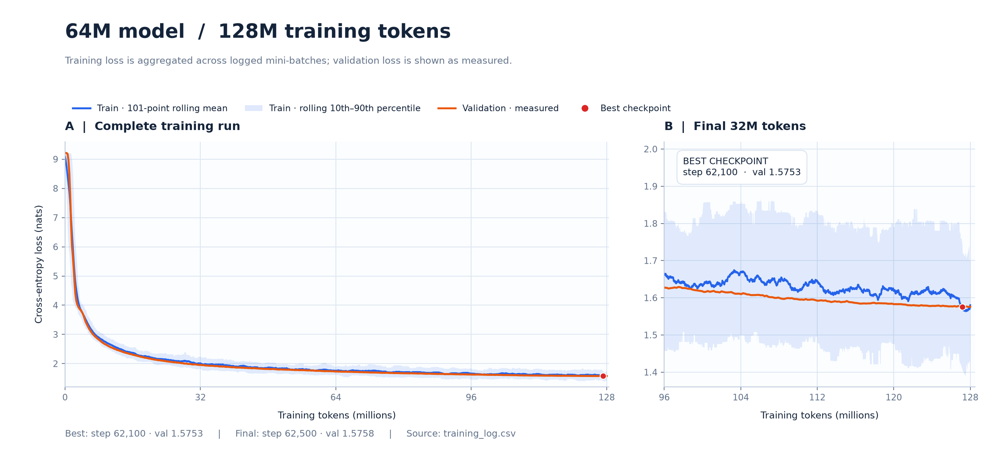
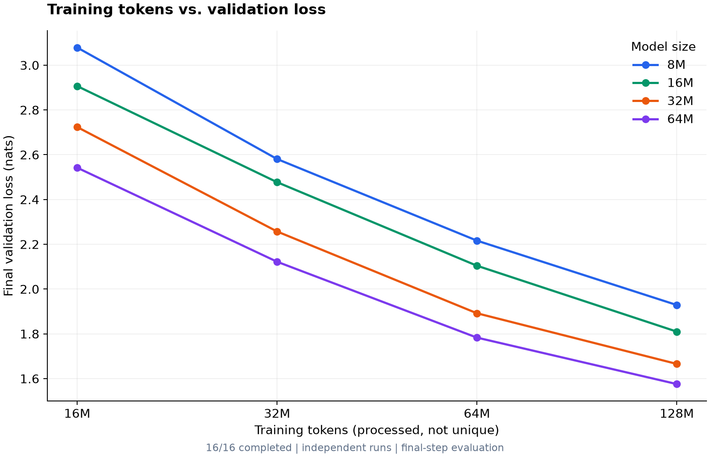
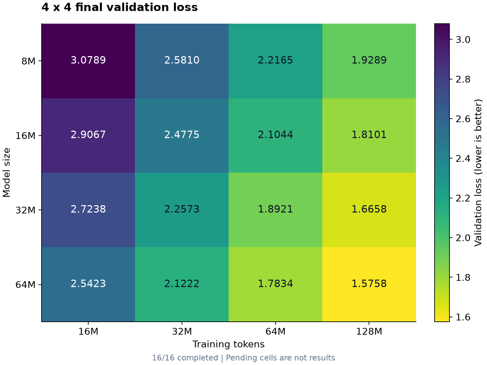
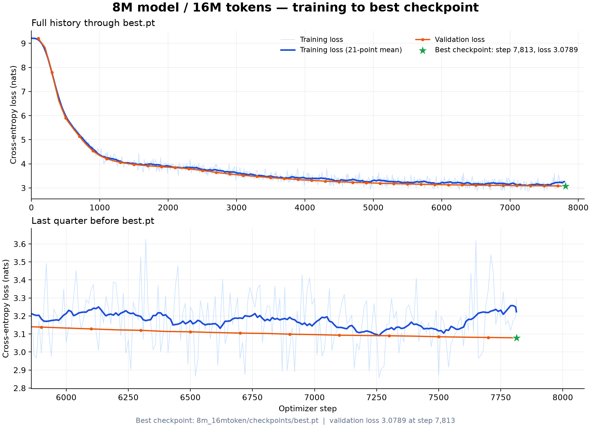
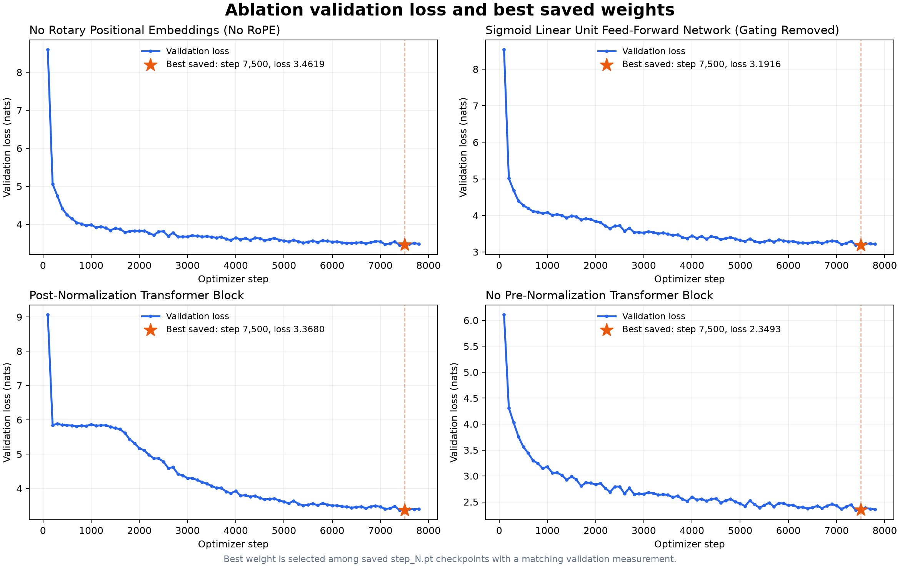

# From-0-to-1-my-own-model-base-on-cs336

从零实现语言模型的组件、训练与评估。 
目前已实现实验
1. 64M 参数下训练最佳权重曲线
2. 16组不同规模模型于训练数据对scaling law 进行观察
3. 对Pre-norm(post-norm, no-norm), RoPE, FFN 进行四组消融实验

## 64M 参数下训练最佳权重曲线

  

64M 模型实际包含约 **66.1M** 参数，在 **128M tokens** 预算下训练。左侧展示完整训练轨迹，右侧放大最后 32M tokens 的收敛过程。最佳权重出现在第 **62,100 步**，验证损失为 **1.5753**；第 62,500 步结束时的验证损失为 **1.5758**。图表由[Matplotlib 绘图脚本](scalling_exp/plot_64m_best_checkpoint.py)读取[逐步训练记录](scalling_exp/64m_model/64m_128mtoken/training_log.csv)生成，数值与[实验结果](scalling_exp/64m_model/64m_128mtoken/result.json)一致。

## Scaling Law 探索 · 模型规模 × 训练 token

**实验问题：** 在 8M、16M、32M、64M 四档模型规模和 16M、32M、64M、128M 四档 token 预算下，最终验证损失如何变化？两张图从不同角度展示同一组 **4 × 4** 实验。

四种模型分别使用以下结构；每种结构都在四档训练 token 预算下独立训练，构成 16 组实验。

| 名义模型规模 | d_model | d_ff | num_layers | num_heads |
| --- | ---: | ---: | ---: | ---: |
| 8M | 256 | 768 | 4 | 4 |
| 16M | 384 | 1152 | 4 | 6 |
| 32M | 512 | 1536 | 6 | 8 |
| 64M | 640 | 1920 | 10 | 10 |

<table>
  <tr>
    <th width="50%">A · Token 预算与验证损失</th>
    <th width="50%">B · 16 组实验全景</th>
  </tr>
  <tr>
    <td></td>
    <td></td>
  </tr>
  <tr>
    <td>沿每条曲线向右：更多训练 token 对应更低的最终验证损失。</td>
    <td>沿每列向下：相同 token 预算下，更大模型对应更低的最终验证损失。</td>
  </tr>
</table>

**观察。** 64M 模型从 16M 训练 token 增加到 128M，最终验证损失由 **2.5423** 降至 **1.5758**。在这四档预算中，每次 token 翻倍仍有收益，但改善幅度逐渐缩小。64M × 128M 是当前网格中的最佳组合。

**解释边界。** 上述 16 个数值均是单次运行的**最终一步**评估，而上方的 1.5753 是训练期间的**最佳检查点**结果。它们支持当前范围内的 scaling 趋势；尚未拟合幂律指数，也没有多随机种子的不确定性估计。[查看完整结果表](scalling_exp/results_summary.csv)。

## 8M 基线与消融实验

### 8M 模型 · 16M tokens 训练曲线

  

### 四组消融实验 · 验证损失曲线

  

### 消融实验对比

| 实验设置 | 最佳已保存权重的验证损失 |
| --- | ---: |
| 无旋转位置编码 | 3.4619 |
| Sigmoid Linear Unit 前馈网络 | 3.1916 |
| 后归一化 Transformer 块 | 3.3680 |
| 无预归一化 Transformer 块 | 2.3493 |

## 脚本用途

`cs336_basics/` 包含模型、分词器与优化器。`cs336_basics/public/` 中是可以公开的入口脚本；个人实验的原文件和具体参数不上传。

- [训练脚本](cs336_basics/public/training.py)：读取 token 数据，构建模型，执行训练、验证和保存模型检查点。运行 `python -m cs336_basics.public.training --config CONFIG.json`。训练集路径、模型结构和训练参数都由本地 JSON 配置提供；脚本中的 `REQUIRED_KEYS` 列出了必填项。
- [对话脚本](cs336_basics/public/chat.py)：读取模型检查点、词表和 BPE 合并规则，从提示词生成回复。运行 `python -m cs336_basics.public.chat --config CONFIG.json`。配置需提供 `checkpoint_path`、`vocab_path`、`merges_path` 和模型结构参数；输入 `quit` 退出。
- [数据集转 token 脚本](cs336_basics/public/tokenize_dataset.py)：把 UTF-8 文本逐行转换为 `uint16` token 的 `.bin` 文件，供训练读取。运行 `python -m cs336_basics.public.tokenize_dataset --input TEXT --output TOKENS.bin --vocab VOCAB.pkl --merges MERGES.pkl`。从已有分词断点继续时，增加 `--resume-checkpoint CHECKPOINT.json`，脚本会核对现有输出后追加写入。

分词断点记录文本转换进度；训练检查点保存模型与优化器状态，它们是两类不同的文件。请将个人配置、数据和权重保存在仓库之外。
